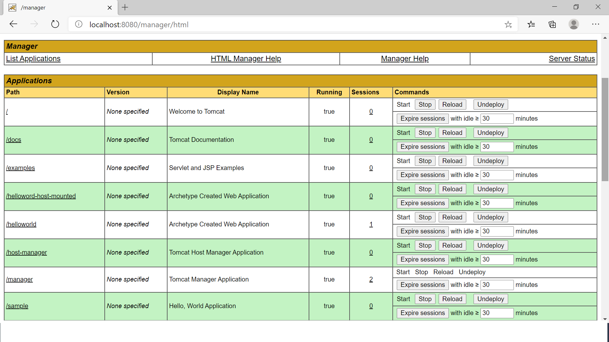

# Tomcat Extended 

## Tomcat Extended - War deployment from remote URL, local folder and mounted folders. Enable users and roles

This is a docker image that is identical to the official tomat image, extended with additional war deployment and user/role configurations

## Running

**Latest from Docker Hub:**

```sh
docker run --name=tomcat -it --rm -p 8080:8080 techforum/tomcat-extended
```

The sample war file(sample.war) is deployed from https://tomcat.apache.org/tomcat-7.0-doc/appdev/sample/sample.war, also helloword.war is deployed from local machine

The tomcat-users.xml(/usr/local/tomcat/conf/tomcat-users.xml) file is enabled with required user/roles.

The context.xmlfiles(/usr/local/tomcat/webapps/manager/META-INF/context.xml & /usr/local/tomcat/webapps/host-manager/META-INF/context.xml) are modified to enable the external access for manager/host-manager applications.

**Run From Source:**

Clone the repo(git clone https://github.com/techforum-repo/docker-projects.git) and cd to the tomcat-extended ,run the `./build.bash` script.

Execute docker run command specified above.

Modify the sample war file paths in the docker file

Modifify tomcat-users.xml based on your need

Modify context.xml for restricting the manager/host-manager external access.

**Mount application(war) from host machine**

The required configurations are enabled in docker-compose.yml file, modify the application file name
Execute the below command from project root folder(the location of docker-compose.yml file)

The application will be re-deployed on every change from the host folder. The docker-compose.yml file is enabled with jacoco agent confiuration for remote coverage

```
docker-compose up
```

The applications and management URL's can be accessed now

Credential for manager UI - tomcat/Welcome1



**View Container Logs**

```
docker logs tomcat
```